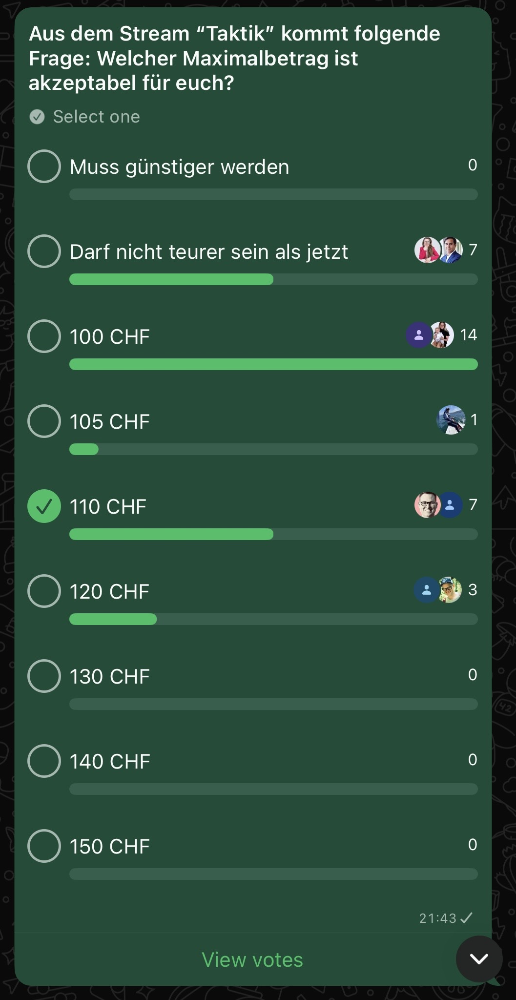
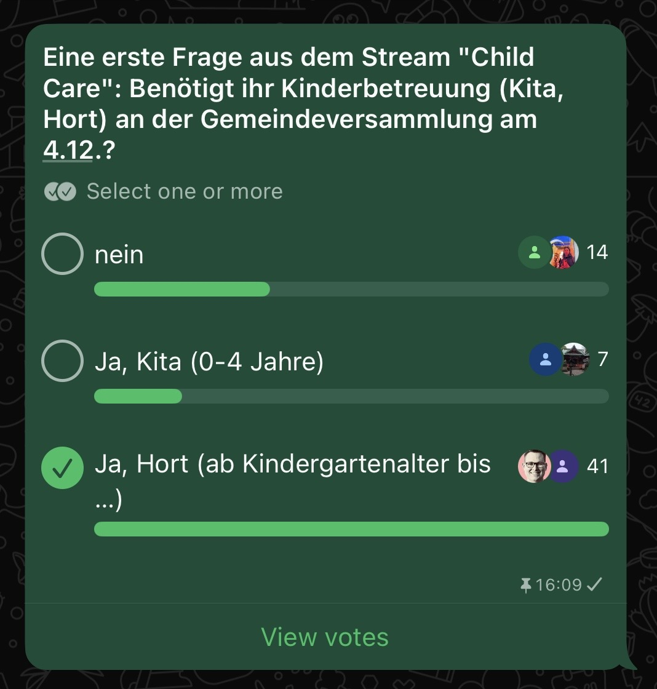

# Bisher erreicht

* Whatsapp Community gegründet, aktuell 285 Mitglieder
* Projekt Streams aufgesetzt
** Stream 1: Taktik Gemeindeversammliung
** Stream 2: Child Care Gemeindeversammlung
** Stream 3: Zukunftsvision Schule & Betreuung
** Stream 4: Mobilisierung
** Stream X: Community Management

# Feedback aus den Streams
* Stream 1: Taktik Gemeindeversammliung
** Datenanalysen und Argumente werden zusammengetragen
** Primär wird jedoch der letzte offenen Gegenvorschlag (GLP) abgewartet
** Erster Poll bezüglich akzeptabler Preisgestaltung wurde durchgeführt
  

* Stream 2: Child Care Gemeindeversammlung
** Durch eine Whatsapp-Umfrage wurde die "allgemeine Nachfrage nach Kita/Hort" während der Gemeindeversammlung abgeklärt, der aktuelle Stand ist 41x "Ja, Hort" und 7x "Ja, Kita". Somit haben wir klar eine Nachfrage nach Betreuung an der Gemeindeversammlung.
  
** Es wurden zwei Räumlichkeiten an zentraler Lage angeschaut (Idee: 1x Hort, 1x Kita)
** Detailabklärungen laufen aktuell in diverse Richtungen (Was dürfen wir, was müssen wir, was brauchen wir etc.) 

* Stream 3: Zukunftsvision Schule & Betreuung
** Eine erste Umfrage zum Interesse an einer Tagesschule wurde durchgeführt. 57x ja, 3x eher ja, 10x kommt sehr auf die Details an, 1x eher nein, 2x nein
  
* Stream 4: Mobilisierung
** keine aktivitäten, noch sehr abhängig von gewählter Taktik

* Stream X: Community Management
** Zur Sicherheit wurde ein zweiter Administrator bennant (Max Hacker), bis sich ein kleines Team konstituriert hat, um die Sache richtig zu übernehmen